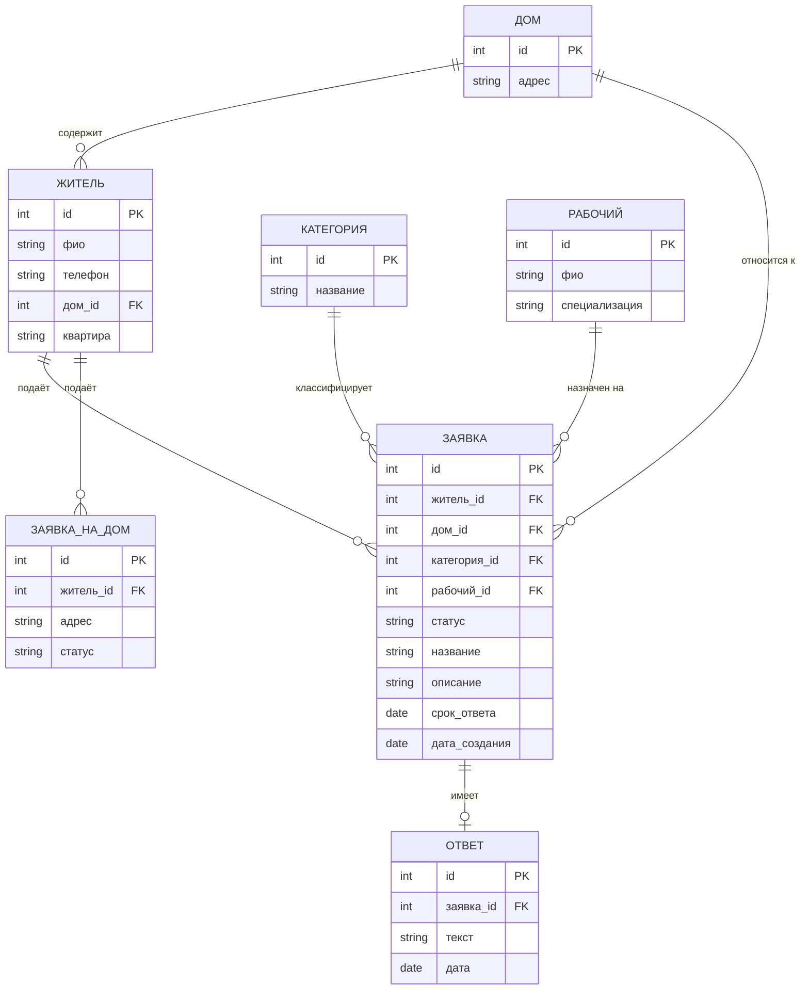

# Концептуальная схема данных «Заявки УК»

- Один дом — много жителей и много заявок (1:N).
- Один житель — много заявок и много заявок на добавление дома (1:N).
- Одна категория — много заявок; один рабочий — много назначенных заявок (справочные связи).
- Заявка имеет не более одного ответа (1:0..1) — ответ появляется после исполнения.
Связь между ответом на заявку и рабочим решил не делать, т.к. по заявке и так ясно, кто прикреплен к ней, и кто ответит.
