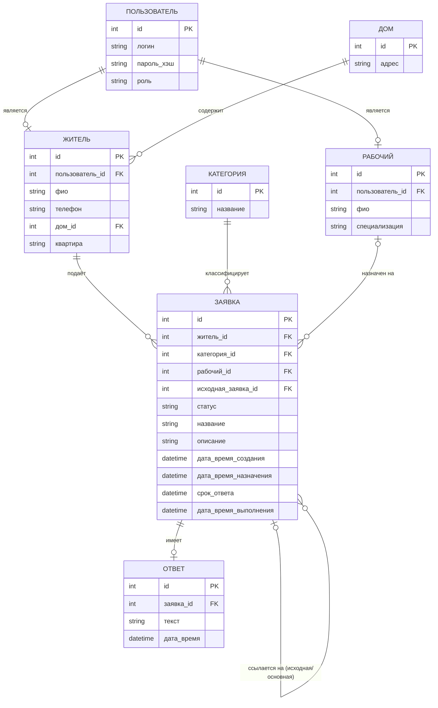

# Концептуальная схема данных «Заявки УК»

```mermaid
erDiagram
  ПОЛЬЗОВАТЕЛЬ ||--o| ЖИТЕЛЬ : "является"
  ПОЛЬЗОВАТЕЛЬ ||--o| РАБОЧИЙ : "является"
  ДОМ ||--o{ ЖИТЕЛЬ : "содержит"
  ЖИТЕЛЬ ||--o{ ЗАЯВКА : "подаёт"
  КАТЕГОРИЯ ||--o{ ЗАЯВКА : "классифицирует"
  РАБОЧИЙ o|--o{ ЗАЯВКА : "назначен на"
  ЗАЯВКА ||--o| ОТВЕТ : "имеет"
  ЗАЯВКА o|--o{ ЗАЯВКА : "ссылается на (исходная/основная)"

  ПОЛЬЗОВАТЕЛЬ {
    int id PK
    string логин
    string пароль_хэш
    string роль
  }
  ДОМ {
    int id PK
    string адрес
  }
  ЖИТЕЛЬ {
    int id PK
    int пользователь_id FK
    string фио
    string телефон
    int дом_id FK
    string квартира
  }
  КАТЕГОРИЯ {
    int id PK
    string название
  }
  РАБОЧИЙ {
    int id PK
    int пользователь_id FK
    string фио
    string специализация
  }
  ЗАЯВКА {
    int id PK
    int житель_id FK
    int категория_id FK
    int рабочий_id FK
    int исходная_заявка_id FK
    string статус
    string название
    string описание
    datetime дата_время_создания
    datetime дата_время_назначения
    datetime срок_ответа
    datetime дата_время_выполнения
  }
  ОТВЕТ {
    int id PK
    int заявка_id FK
    string текст
    datetime дата_время
  }
```  

- Один пользователь — не более одного жителя или рабочего (1:0..1).
- Один дом — много жителей (1:N).
- Один житель — много заявок (1:N).
- Одна категория — много заявок (1:N).
- Один рабочий — много назначенных заявок (0..1:N).
- Одна заявка — может ссылаться на одну исходную заявку (0..1:N) для связывания дубликатов и повторных обращений.
- Заявка имеет не более одного ответа (1:0..1) — ответ появляется после исполнения.  

Связь между ответом на заявку и рабочим решил не делать, т.к. по заявке и так ясно, кто прикреплен к ней, и кто ответит. Так же с домом. 